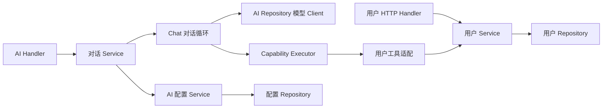

# 当前项目结构

本说明描述当前代码。未来 Agent、会话持久化、规划器与记忆设计见 [后续设计](design/assistant-roadmap.md)，不视为已经实现。

## 后端目录

```text
backend/
  main.go                    进程信号与退出状态
  internal/
    app/                     依赖组装、迁移、默认数据、HTTP 生命周期
      app.go                 资源打开、运行、关闭
      wire.go                共享服务、工具、Handler 的唯一组装位置
      migrate.go             当前应用拥有的表
      seed.go                调用默认用户业务及可选开发凭证输出
    config/                  配置类型、默认值、文件加载及校验
    platform/
      database/mysql.go      MySQL 连接与 DSN
      logging/zap.go         Zap 创建及轮转设置
    router/                  路由汇总与存活检查，不访问数据库
    auth/
      handler/               login/captcha HTTP 适配与对应请求、响应类型
      service/login.go       账号认证与验证码服务组合
      service/token.go       JWT 签发与验证
      service/captcha*.go    实例内验证码存储及图片绘制
      middleware.go          Bearer 解析与可信身份注入
    user/
      model/                 用户与角色类型，不属于仓储
      repository/            create/read/update/delete SQL 和数据库错误映射
      service/               注册、查询、更新、删除、管理员授权
      handler/               用户 HTTP 协议，包括 /users/me
      capability/definitions.go  用户工具描述、Schema、参数及错误适配
    aiconfig/                AI 连接配置，按 handler → service → repository 分层
      model/                 持久化模型、无密钥摘要，保留原表名
      handler/               create/read/update/delete、providers/models HTTP 适配
      service/               CRUD 授权、PATCH 白名单、提供商与目录规则
      repository/            CRUD SQL、可见范围及外部模型目录请求
      router.go              保留 /setting/ai 的旧 URL，响应统一 code/message/data
    ai/                      handler → service → repository，模型上游属于仓储边界
      model/                 文本输入、工具协议、对话结果与截图识别契约
      handler/               chat/screenshot HTTP 适配及统一响应
      service/               配置授权、对话循环、截图版本检查与时限
      repository/            chat/screenshot 上游 HTTP 请求及协议解析
      router.go              注册 /ai/chat 与 /ai/screenshot
    task/                    handler → service → repository，共用 HTTP 与 AI 业务
      model/                 task/list/event 归属模型与原表名
      handler/               命令请求解析、状态码、统一响应
      service/               任务树、进度、排序、清单与字段校验
      repository/            create/read/update/delete、用户锁与事务
      capability/            任务 AI 工具定义与业务错误适配
      router.go              注册 /tasks 与 /task-lists
    finance/                 handler → service → repository，精确金额与原子账本
      model/                 账户、分类、流水、快照、分期和贷款公开契约
      handler/               命令、筛选及同步请求解析与统一响应
      service/               CRUD、收支统计、贷款、分期、周期计划、幂等编排
      repository/            create/read/update/delete、query、sync、transaction
      capability/            AI 查询与待确认流水能力，不授予确认或作废权限
      router.go              注册 /finance 路由，保留现有 URL
    health/                  handler → service → repository，个人健康快照与分析
      model/                 日汇总和报告，保留 health_days/health_reports
      handler/               read/sync/create/delete HTTP 适配
      service/               日期数值校验、外发同意、配置授权与分析
      repository/            日快照 upsert、报告读取保存和用户数据清理
      router.go              注册 /health-management 路由
    response/                所有 HTTP 入口共用 code/message/data 信封
    capability/              通用能力定义、注册、执行及公开错误契约
```

## 职责与依赖约束

- `app` 创建并注入服务。业务包不得导入 `app`，Handler 不接收整个启动资源容器。
- 路由函数只绑定路径和处理器；`app.Initialize` 显式执行迁移与默认数据初始化。`app.New` 可在没有业务表时完成组装。
- HTTP 用户入口直接调用类型化用户 Service；AI 工具通过 Executor 和业务适配器调用同一个 Service。两条路径共用管理员授权和字段规则。
- 可信 Actor 由认证入口生成并传入工具执行；模型参数中的目标用户 ID 不代表操作者身份。
- Repository 负责 SQL，Service 负责规则。PATCH 重新构造白名单 `map[string]any`，持久化只使用这份 map。
- 模型协议与业务编排分目录维护。`Completer` 是实际需要替换的外部依赖边界；目前只有一种协议，不额外建立提供商适配框架。
- 通用 Capability 不认识用户表或用户错误；用户工具适配器将可公开的业务错误转换为 `PublicError`，AI 隐藏未分类错误。



## 文件拆分原则

用户模块保留已有分层，因为其业务规则和多个入口已有实际规模。简单仓储 CRUD 合并为一个文件；注册与更新校验仍分别维护。AI 配置规模较小，先采用单包多文件，不为每个函数创建子目录。静态提供商目录不建立 Repository。

认证与用户管理保持独立：前者确认身份，后者管理账号和资料。AI 配置属于运行时业务，前端是否将它显示在设置菜单不决定后端归属。

## 前端与停用功能

AI 配置 API 放在 `api/aiConfig.ts`，个人偏好协议放在 `api/preferences.ts`。`types/api.ts` 只存放公共响应信封，用户、认证、任务、配置类型分别归属独立文件。

个人偏好后端已删除，路由显示占位页，不恢复对应服务或迁移历史表。任务模块已恢复并接入共享 Capability，详见 [任务管理](task-management.md)。日历保持停用。财务已恢复账户、流水、总览和 AI 草稿，贷款与房贷组件保留但不接入；金额、幂等、迁移和验证边界见 [财务管理](finance-management.md)。

## 兼容范围与后续工作

保持旧 URL、表名、配置键、公开注册与用户列表行为。管理员与系统管理员的现有权限范围不在本轮重新定义。AI 配置创建沿用现有归属与共享字段语义，没有在结构调整中引入新的归属授权策略；严格创建权限和地址策略应作为后续独立变更。

创建配置改用独立 DTO，响应不再回显密钥；客户端不再提交主键、创建者或更新时间。配置读取把 ID 和可见条件放在同一次 SQL 查询，避免用全量列表授权后重新无条件读取。

当前验证码仍是单实例存储，未引入共享缓存；当前对话没有持久化或自动重试。HTTP 停机等待在途请求，数据库在服务结束后关闭。生产资源配置与部署保持独立，见 [部署说明](deployment.md)。

## 验证入口

`internal/app/app_test.go` 验证真实路由、SQLite 持久化、共用授权、局部更新、配置可见范围和模拟模型调用。模拟传输走真实模型请求编码及响应解析，但不监听端口或访问外部网络。测试不验证 MySQL 行锁实现与真实模型兼容性。

## 本轮验证记录

已通过 Go 1.27.1 的 `go test ./...`、`go vet ./...`，以及 `CGO_ENABLED=0 GOOS=linux GOARCH=arm64 go build`。前端 `npm run build` 和 13 项 `npm test` 用例通过；现有依赖注释与打包体积警告仍存在。

额外尝试的 `go test -race ./...` 未完成：本机工具链的 `runtime/race` 报包加载错误，在项目外的空测试模块也可复现。因此本轮不能声明竞争检测通过。未连接真实 MySQL、调用真实模型或执行远程部署。

## 统一接口与同步记录

普通 HTTP JSON 接口返回 `code/message/data`，`code` 等于 HTTP 状态码。查询、修改和删除成功返回 200，创建资源返回 201；删除成功与所有错误返回 `data:null`。AI 对话开始执行工具后的失败保留在 `data.error`，并返回已经发生的 `data.actions`，避免丢失操作状态或重复执行。

任务、记账、健康、AI 与存活检查的 57 个接口见 [OpenAPI 契约](api/internal.openapi.json)，Apifox 的分支、接口 ID、模型 ID 与回读结果见 [同步记录](api/apifox-internal-sync.json)。用户、认证与模型配置按已完成的独立契约维护。

基础模块 `app/config/platform/router/response/capability` 按生命周期、配置、平台资源、HTTP 汇总和能力执行职责组织；它们没有业务 CRUD，不建立空的 handler/service/repository 目录。服务层控制事务业务范围，仓储层执行 SQL；任务树变更、账本余额与事件、同步命令与幂等回执仍保持原有原子提交边界。
